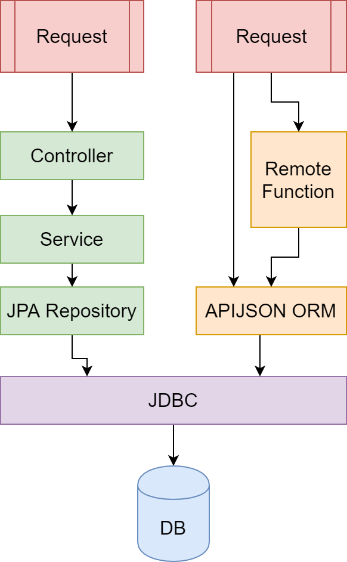

# APIJSON Todo Demo

一个试图让 APIJSON 上手更简单一些的尝试。

本示例项目是一个基于 APIJSON 实现的 todo 系统，在官方示例项目（APIJSON-Demo）的基础上进一步简化了数据库和代码，完整实现了对一个业务表的单独/批量 CRUD 操作，并描述了如何用远程函数实现一个简单的自定义鉴权逻辑。

:warning: 本项目文本最后更新于 2021 年 8 月（APIJSON 版本 4.7.2），后续维护只是跟随官方更新版本号，文中的文字描述和技术原理可能已经发生变更。如果在阅读时注意到不一致之处，欢迎提出 issue 和 pull request，我会在力所能及的范围内尽量修复。

:warning: 部分内容为个人猜测，不保证正确性，如有错漏，还请指正！

## 引言

APIJSON 是一个很有趣的框架，但是官方文档分散在各处（README，issues，code），加之官方示例中数据库内数据较多，各个功能代码庞杂，作为新手想要上路还是有一些困难的。官方文档对如何使用各个操作符完成查询着墨较多，但是对于如何从零开始搭建一个系统讲的比较少。本项目想要尝试补全这一空白。

对于一个 CRUD 系统，最常见的 hello world 项目莫过于一个简单的 todo (待办事项) 系统。通常而言，能够自己实现一个这样的系统，基本就对这个系统入了门，可以开始将这个系统为我所用了。本 Repo 中已经完成了这个系统。你可以自己尝试从头实现，用这个项目作为参考，也可以基于这个项目扩展功能。


## 初始化这个项目

1. 把整个项目 clone 到本地

2. 用根目录下的 initdb_final.sql 初始化数据库

3. 用 IDEA 打开项目，进入 pom.xml ，右键 Maven - Reload

   > 如果遇到了 Maven 报错提示找不到 APIJSON 包，请参考「杂项」一节中[「Maven 报错无法找到 APIJSON 包」]([apijson_todo_demo/FULLTEXT.md at master · jerrylususu/apijson_todo_demo (github.com)](https://github.com/jerrylususu/apijson_todo_demo/blob/master/FULLTEXT.md#maven-报错无法找到-apijson-包))

4. 进入 apijson/demo/config/DemoSQLConfig.java 修改数据库配置，包括数据库类型，默认 schema 名，数据库版本号，JDBC 连接字符串，数据库用户名和密码

5. （推荐）打开 Postman，导入根目录下的 demo.postman_collection.json，其中含有一些预先准备好的请求

6. 进入 DemoApplication，右键 Run 'DemoApplication'


如果你想要更深入的探究框架的内部工作机制，推荐你在 pom.xml 中禁用 apijson-framework 和 APIJSON 两个依赖项，然后手动去 [APIJSON/APIJSONORM](https://github.com/Tencent/APIJSON/tree/master/APIJSONORM) 和 [APIJSON/apijson-framework](https://github.com/APIJSON/apijson-framework) 把这两个依赖的源代码下载回来，然后放置到 src 文件夹下。这一步完成后，你的 src/main/java/apijson 下应该有 demo, framework, orm 三个文件夹，以及一些从 APIJSONORM 复制过来的一些文件。这样做的好处是当你断点/搜索的时候，可以更容易的访问到框架内部代码，也可以修改内部代码，观察会发生什么变化。


## 项目场景简介

本项目中我们实现了一个自定义权限的待办事项系统。

在这个系统中，每个用户有一个自己的 friends 列表，而每个 todo item 都有一个自己的 helper 列表。todo 对所有用户可见，但是只有其创建者可以删除。当前登录的用户，可以创建新的 todo，增加/删除自己的 friend，也可以增加/删除自己所创建的 todo item 中的 helper 列表。比较复杂的是对 todo 的修改操作，你可以想象成一个简单的共享模型。一个用户可以修改某个 todo，如果

* 这个用户是这个 todo 的创建者，或者
* 这个用户在这个 todo 的创建者的 friend 列表中，或者
* 这个用户在这个 todo 的 helper 列表中。


## 框架相关

### 必备参考链接

设计规范：https://github.com/Tencent/APIJSON/blob/master/Document.md#3

提问前必看：https://github.com/Tencent/APIJSON/issues/36

实现原理：https://github.com/Tencent/APIJSON/wiki#%E5%AE%9E%E7%8E%B0%E5%8E%9F%E7%90%86

「详细的说明文档」：https://github.com/Tencent/APIJSON/blob/master/%E8%AF%A6%E7%BB%86%E7%9A%84%E8%AF%B4%E6%98%8E%E6%96%87%E6%A1%A3.md

文档网站：https://vincentcheng.github.io/apijson-doc/zh/newinterface.html#%E5%90%8E%E5%8F%B0%E6%B7%BB%E5%8A%A0%E6%95%B0%E6%8D%AE%E8%A1%A8

路线图：https://github.com/Tencent/APIJSON/blob/3c9084479876748055ebe048d388098ef05c3e23/Roadmap.md

QQ 技术群： 734652054（新）、607020115（旧）

### 访问方法、请求体与 Request

APIJSON 支持以下的访问方法：

* GET 获取
* HEAD 计数
* GETS 安全/限制性获取
* HEADS 安全/限制性计数
* POST 新增
* PUT 修改
* DELETE 删除

这些访问方法又被分为两类：

* GET / HEAD 是开放请求，可以随意组合嵌套
* 其他方法是私密/非开放请求，需要符合预先定义好的安全规则才能调用

> 注：GETS 不支持返回多条记录（参见 https://github.com/Tencent/APIJSON/issues/273）

对于私密/非开放请求，其安全规则在 Request 表中定义，包含以下几个部分（见 「设计规范」 3.1 节底部注释）

* method，即这条规则所适用的访问方法
* tag，某条规则的名字/标识，大部分情况下为操作的表的名字。（但是也有一些例外，见后文）
* version，版本号。不传，为 null 或 <=0 都会使用相同 method + 相同 tag 的版本号最高的规则，如果制定了版本则使用对应版本的规则
* structure，结构，是一个描述请求体需要满足的结构的 JSON

以下是一条规则的示例。

| version | method | tag  | structure                                                    |
| ------- | ------ | ---- | ------------------------------------------------------------ |
| 1       | POST   | Todo | {"MUST": "title", "UPDATE": {"@role": "OWNER"}, "REFUSE": "id"} |

这条规则规定了如果想要用 POST 方法在 Todo 表中添加一行数据，请求体中必须要有 `"tag":"Todo"`，且请求体中必须有 title，不能有 id，而且权限（`@role`）会被覆盖为 OWNER。以下是一个满足该规则的请求示例。关于规则中可以使用的关键词，可以参见 apijson.orm.Operation 中的注释。

```json
{
    "Todo": {
        "title": "write doc",
        "note": "apijson quickstart"
    },
    "tag": "Todo"
}
```

在 APIJSON，对于一个业务表（在我们的项目中是 `Todo` 表）的 CRUD 操作，查询已经由 GET / HEAD 帮我们代办了，我们需要完成的就是在 Request 表中补全对应表的 POST/PUT/DELETE 操作规则。这三个操作都有单独操作和批量操作两个变种，PUT的批量操作也有统一设置和单独设置两种形式（见「设计规范」3.1节），因此对于一个业务表，通常需要在 Request 表中增加七条规则。

在上面的 POST 请求示例中，你可能会注意到，我们的请求体似乎只有在 `"Todo"` 内才满足 structure 要求，但是就整个 JSON 而言并不满足。这就引出了 tag 为表名时的特殊作用：如果 tag 是表名，APIJSON 会自动帮我们把规则中的 structure 外面用表名包上一层。（https://github.com/Tencent/APIJSON/issues/115#issuecomment-565733254）

* 判定 tag 是否是表名，是根据其开头首字母是否是大写来判断的 (见 apijson.JSONObject.isTableKey)

换句话说，对于同一个 structure，进行校验的时候，实际上是

```json
{"Todo": {"MUST": "title", "UPDATE": {"@role": "OWNER"}, "REFUSE": "id"}}
```

这样看来就和我们的请求能对上了。

与之对应的，如果 tag 不是表名（即首字母不是大写），那么就必须要在 structure 内写出完整的 JSON 结构要求。一般有两种情况会需要设定 tag 不是表名的规则。一是多表操作，例如注册，需要同时在 User 表（用户公开信息）和 Credential 表（用户隐私信息，官方示例中为 Privacy 表）中进行插入。以下是一个用于注册的规则示例。

| version | method | tag          | structure                                                    |
| ------- | ------ | ------------ | ------------------------------------------------------------ |
| 1       | POST   | api_register | {"User": {"MUST": "username,realname", "REFUSE": "id", "UNIQUE": "username"}, "Credential": {"MUST": "pwdHash", "UPDATE": {"id@": "User/id"}}} |

这条规则看起来复杂了很多，但是可以从外到内分析。首先最外层的两个 Key，分别定义了这个 POST 请求要操作的两张表。然后每个表内部，又定义了针对这张特定的表所需要的输入要求。UNIQUE 要求在 User 表中 username 唯一，UPDATE 中 id@ 则是一个引用赋值，指在 User 表插入完成后，用 User 表中的 id 作为 Credential 表的 id。（APIJSON 默认使用毫秒精度的当前时间戳作为主键，但可以修改为自增主键，见「提问前必看 11.如何使用自增主键？」）以下是一个满足该要求的请求体。

```json
{
    "User": {
        "username": "user",
        "realname": "apijson"
    },
    "Credential": {
        "pwdHash": "2333"
    },
    "tag": "api_register"
}
```

请注意，请求体中的相对顺序十分重要！在 Structure 中我们让 Credential 引用了 User/Id，那么在请求体中我们也必须要让 Credential 在 User 之后，不然这个引用赋值不会成功，而且返回的结果帮不上什么忙。（见 [建议：在输入引用赋值顺序错误时给出更明显的提示 · Issue #275 · Tencent/APIJSON (github.com)](https://github.com/Tencent/APIJSON/issues/275)）。

另一种需要 tag 非表名的情况是对某些特定列的操作，例如以下规则，可以在某条 todo 上增加一个 helper。（也可以参见官方示例 APIJSONBoot 的 balance+, balance- 两条规则。）

| version | method | tag     | structure                                                    |
| ------- | ------ | ------- | ------------------------------------------------------------ |
| 1       | PUT    | helper+ | {"Todo": {"MUST": "id,helper+", "INSERT": {"@role": "OWNER"}}} |

满足此规则的一个请求体如下。

```json
{
    "Todo": {
        "id": 1627565018422,
        "helper+": [1627508518581]
    },
    "tag": "helper+"
}
```

其中，+号代表「增加或扩展」功能符（见「设计规范 3.2」），当然也有-号，代表「减少或去除」。在这个例子里，helper 是一个 `List<Long>`，序列化存入 DB 后是一个 `JSONArray`。不幸的是，因为 structure 中 key 部分要求完全相等，即 `helper+` 无法匹配 `helper-`，所以需要还需要一条规则来在某条 todo 上减少一个 helper。

顺带一提，在前文提到的批量 POST/PUT/DELETE 中，structure 也可以正常使用，只需要把需要判断的部分用数组包起来，就可以应用到包含数组的请求体中了。请见下面这个规则，用于一次新建多条 todo。注意用于单个 todo 的 MUST 和 REFUSE 规则现在被包在一个数组里。

| version | method | tag     | structure                                                    |
| ------- | ------ | ------- | ------------------------------------------------------------ |
| 1       | POST   | Todo:[] | {"Todo[]": [{"MUST": "title", "REFUSE": "id"}], "UPDATE": {"@role": "OWNER"}} |

这个 tag 名看起来可能有些怪异（为什么后面有 `:[]`？）。其实这是一个 APIJSON 框架的约定，代表这是一个批量操作，其中每个对象被独立描述，然后被收集在一个数组中。以下是一个满足该规则的请求体。

```json
{
    "Todo[]": [
        {
            "title":"hi there",
            "note": "apijson"
        },
        {
            "title": "today is good",
            "note": "thanks to apijson"
        }
    ],
    "tag": "Todo:[]"
}
```

为了勾起读者的好奇心，以下是一个删除单一 todo 的规则。请猜猜看 REFUSE 中的 `!` 代表的含义。

| version | method | tag  | structure                                                   |
| ------- | ------ | ---- | ----------------------------------------------------------- |
| 1       | DELETE | Todo | {"MUST": "id", "REFUSE": "!", "INSERT": {"@role": "OWNER"}} |

（答案：拒绝除了 MUST 中声明的 key 之外的其他所有 key。参见官方示例 APIJSONDemo Request 表 id=8）

### 访问控制、角色和 Access 表

> 在早期的 APIJSON 版本中，需要需要用 `@MethodAccess` 注解来标注某个类对应的表的访问权限，但是现在的版本中直接改 Access 表就可以了。

权限系统是现代服务中绕不过的一个话题，APIJSON 也针对这一问题交出了自己的答卷。Access 表就是 APIJSON 的权限中心，其中定义了对于数据库中的每张表，哪些角色（RequestRole）可以调用什么请求方法。

APIJSON 中的默认角色有以下几类：（参见 https://github.com/Tencent/APIJSON/issues/67#issuecomment-453428079，具体实现参见 AbstractVerifier.verifyAccess 方法）

- UNKNOWN：用户未登录时的默认角色（用户登录用的是服务端的 HttpSession，这里即 userId <=0 或为 null）

- LOGIN：用户登录后的默认角色（userId > 0）

- OWNER：请求对象的创建者是当前用户（userId = $currentUserId）

- CONTACT：请求对象的创建者在当前用户的好友列表中（userId IN( $currentContactIdList ) ）

- CIRCLE：请求对象的创建者在 当前用户的好友列表加上当前用户自己 得到的列表中

  （userId IN( $currentCircleIdList ) // currentCircleIdList = currentContactIdList.add(currentUserId)）

* ADMIN：管理员权限，默认不支持，需要手动重载 verifyAdmin 方法实现。

其中：

* UNKNOWN，LOGIN 是默认角色，会根据用户的登陆与否自动分配
* 其他角色需要用户在请求体中手动用类似于 `"@role" = "OWNER"` 的形式声明

APIJSON 的这个权限模型应该是从微信朋友圈获得的灵感，毕竟在刷朋友圈的时候可以看到自己+联系人的动态。这也难怪为什么官方示例的数据库是一个类似于朋友圈的项目了。不幸的是，对于许多其他项目，这一权限模型可能不是很合适。例如在我们这个示例项目的场景中，要判定一个 todo 的能否修改，不仅要判断创建者的 friend，还要判断 todo 本身的 helper。另外，即使我们忽略 helper 这个需求，我们需要判定的是「当前用户」是否在「todo 创建者的 friend」列表中，而不是「todo 创建者」是否在「当前用户的 friend」列表中，因此 CIRCLE 角色对我们是没有帮助的。

了解了角色之后，Access 表也就很简单了：每一行是一张表，每一列是一个访问方法，每一格则是角色数组。只有在这个数组内的角色才能用这个访问方法访问这张表。但是具体设定起来，可能还是会有些头大。以下是一个可能的设置方法：

* 读可以放开，写尽量谨慎。

* 对于用户公开信息（User）、用户隐私信息（Credential/Privacy）、远程函数（Function）表，参考 APIJSONDemo 中的设定方式。
* 对于业务表，如果资源登陆后可见则不设定 UNKNOWN。每个操作最好都允许 ADMIN。POST 一般 LOGIN 就足够了。DELETE 一般需要 OWNER。PUT 视情况而定，通常是 OWNER。如果有自定义鉴权逻辑的需求，则需要加上 LOGIN，因为请求中不带 `@role` 的时候登陆后默认身份就是 LOGIN。

需要注意的是，Access 表的权限设定是只对外部请求生效的。如果在后端代码内手动构造并发起 APIJSON 请求，是可以绕过内置的权限控制的，如下代码所示，只需要设定 needVerify 为 false 即可。

```json
// APIJSONParser(RequestMethod method, boolean needVerify)
JSONObject response = new APIJSONParser(POST,false).parseResponse(request);
```

> 注：此处还有一些其他的设定选项，如 setNeedVerifyLogin（验证登录态，内部调用需要设定 false）, setNeedVerifyContent（验证请求是否满足 Request 中 Structure 定义） 

此外，APIJSON 还支持隐藏特定列，只需要在数据库中将列名开头设定为下划线，则该列完全不会出现在 APIJSON 的返回中，无论是内部调用还是外部调用都如此。这一方面的示例可以参见官方示例 APIJSONBoot 中 `login` 方法的实现。在那个实例中，用户密码存储在列名为 `_password` 的列中，登陆的时候后端构造一个带有用户 id 和密码的 HEAD 请求（两个条件之间是 AND），用 APIJSON 调用后查看返回的 count 是否为 1，以此来判断用户 id 和密码是否正确。这样的确可以实现信息的隐藏，但稍有不足之处是无法再使用 BCryptEncrypter 等需要密码哈希的密码验证器，因为无法拿回数据库中存储的密码哈希，只能通过 HEAD 间接验证相等。

以下是对本节的一个简要总结。

| 控制粒度 | 实现                         | APIJSON 内部可绕过              |
| -------- | ---------------------------- | ------------------------------- |
| 表级     | 角色：UNKNOWN, LOGIN, ADMIN  | 可以                            |
| 行级     | 角色：OWNER, CONTACT, CIRCLE | 可以                            |
| 列级     | 数据库：列名前加下划线       | APIJSON 内不可，直接执行 SQL 可 |

### 远程函数和 Function 表

APIJSON 大部分操作都是直接在数据库层面完成的，那么如何在 APIJSON 中调用业务代码呢？答案是远程函数。（个人理解）与传统开发中业务代码为主体不同，在 APIJSON 的视角中，现在大部分公司实际上做的都是 CRUD 的活，因此可以把业务代码抽象为一种 CRUD 的副作用。在 APIJSON 的请求中，如果某个请求的 key 后有 `()`，那么就会被解析为一个远程函数调用请求，从而触发对应的远程函数，并且把结果以相同的 key 返回。从这个层面上看，远程函数几乎类似于数据库中的一个虚拟的列了。

要实现一个远程函数，不仅需要写函数本身的代码，也需要在 Function 表中注册这个函数。以一个最简单的 `sayHello` 远程函数为例子（在本项目中位于 apijson.demo.config.DemoFunctionParser#sayHello）。首先，我们需要 extend APIJSONFunctionParser。在远程函数调用的时候，实际上是从 AbstractParser - APIJSONFunctionParser - DemoFunctionParser 一路找下来的。

```java
public class DemoFunctionParser extends APIJSONFunctionParser {}
```

然后可以实现具体的方法体。（需要注意这里的 name 并不是参数值，而是参数值所在的 key。）

远程函数的返回值一般都是 Object，参数一般是一个 JSONObject 跟着 0 个到多个 String。对远程函数而言，如果返回 null，则只会调用函数，而不会在响应中显示。如果抛出异常，则会中止当前请求。如果返回一个特定的对象，则会被序列化为 JSON，并在响应中显示出来。

```java
public Object sayHello(@NotNull JSONObject current, @NotNull String name) throws Exception{
    // 注意这里参数 name 是 key，不是 value
    Object obj = current.get(name);
    if (obj == null ){
        throw new IllegalArgumentException();
    }
    if (!(obj instanceof String)){
        throw  new IllegalArgumentException();
    }
    return "Hello, " + obj.toString();
}
```

还要在 Function 表中注册函数。（这里填写的 demo 会在 APIJSONApplication.init 方法中用于远程函数的测试，在应用启动的时候会被调一次。）

注意 name 需要完全等于 Java 中的方法名，arguments 的顺序需要完全和 Java 中的方法参数顺序一致（逗号连接，省去第一个 current）。

| name     | arguments | demo             |
| -------- | --------- | ---------------- |
| sayHello | name      | {"name": "test"} |

以下是一个简单的调用示例。（POST /get）

```json
{
    "name": "jerry",
    "ref()": "sayHello(name)"
}
```

返回值也正如预期。

```json
{
    "name": "jerry",
    "ref": "Hello, jerry",
    "ok": true,
    "code": 200,
    "msg": "success"
}
```


然后来看看在远程函数中如何和数据库交互。传统开发中，后端本身用 JPA / Mybatis 之类的工具和数据库交互，前端则是被动地使用后端建立好的各种接口。但是在使用 APIJSON 时，前后端面对的数据库交互界面都是 APIJSON，并没有格式和表达能力上的区分，区别只是后端可以手动跳过验证罢了。这两种开发方式的区别如下图所示。



以这个项目的特殊权限需求为例。对于 PUT todo 的请求，需要得到被操作的 todo 的 id，以及当前登录用户的 userId。随后再从数据库中查出这条 todo 的 helper 列表及创建者的 friend 列表。首先，我们可以用 `this.session` 在远程函数中拿到当前的用户 session，进而拿到用户 id。其次，我们可以利用 Request 的 Structure 规则在 PUT 请求体中插入一个远程调用请求，并拿到 todo 的 id。最后，在我们的远程函数内部，我们可以请求数据库，拿到 todo 的的 helper 列表及创建者的 friend 列表。

首先看看在 Function 中函数的注册信息。（demo 中的 id 其实可以随便写，因为远程函数测试的时候是没有 session 的，测了也没有作用，只要不抛异常就行。）

| name             | arguments | demo            |
| ---------------- | --------- | --------------- |
| isUserCanPutTodo | todoId    | {"todoId": 123} |

具体的函数实现，请参考 apijson.demo.config.DemoFunctionParser#isUserCanPutTodo。其中我们先构造了一个 APIJSON 请求，根据 todoid 同时得到对应的 User 和 Todo 对象。（不用 APIJSON 的话很可能需要两个请求。）注意，这里的顺序也很重要，否则引用赋值可能失败。

```java
JSONObject todoRequest = new JSONRequest();
todoRequest.put(TODO_CLASS_NAME, new apijson.JSONObject(new Todo().setId(TodoId)).setJson("helper"));
JSONObject userRequest = new JSONRequest().fluentPut("id@", "/" + TODO_CLASS_NAME + "/userId").fluentPut("@json", "friends");
todoRequest.put(DemoController.USER_CLASS_NAME, userRequest);
```

构造出的请求如下，其中指定了 Todo.id，并用 Todo 的 userId 赋值给 user。（`@json` 是转为 JSON 格式返回，如果不开启即使数据库中存的是 JSONArray / JSONObject，得到的也是字符串。见「设计文档 3.2 节 对象关键词 8」）

```json
{
    "Todo": {
        "id": 1627761702477,
        "@json": "helper"
    },
    "User": {
        "id@": "/Todo/userId",
        "@json": "friends"
    }
}
```

然后从后端发起请求，并用 `needVerify=false` 跳过验证。

```java
JSONObject response = new APIJSONParser(GET, false).parseResponse(todoRequest);
```

拿到结果后就可以反序列化成对象，进行判断了。

```java
JSONResponse todoResponse = new JSONResponse(response);
Todo todo = todoResponse.getObject(Todo.class);
User user = todoResponse.getObject(User.class);

if (todo.getUserId().equals(uid)) {
    // current user is creator
    continue;
} else if (user.getFriends().contains(uid)) {
    // current user in creator's friend list
    continue;
} else if (todo.getHelper() != null && todo.getHelper().contains(uid)) {
    // current user in todo's helper list
    continue;
}

// 以上验证都没有通过
throw new IllegalAccessException("user don't have permission to put todo!");
```

鉴权函数完成后，为了能让 PUT 请求都能触发鉴权函数，还需要在 Request 表中 PUT 项内加上对应的调用。这样即使请求体内没有显式调用鉴权函数，在经过处理后也会调用。（这里的处理指的是 Parser.ParseCorrectRequest，会检查输入是否满足 Structure 并引用变换。）

| version | method | tag  | structure                                                    |
| ------- | ------ | ---- | ------------------------------------------------------------ |
| 1       | PUT    | Todo | {"Todo":{ "MUST":"id","REFUSE": "userId", "UPDATE": {"checkCanPut-()": "isUserCanPutTodo(id)"}} } |

其中 UPDATE 是不存在则插入，存在则覆盖。`()` 前的 `-` 则制定了这个远程函数的执行优先级，在解析当前对象之前。（见「设计文档 3.2 节 远程调用函数」）

对于批量 PUT 请求，还需要在函数内部判断输入的是单个 id 还是一个 id 的 JSONArray。

前文提及，在 APIJSONApplication 启动的时候会对远程函数进行测试，实际上就是把 demo 列中的作为输入传入远程函数。如果不设定 `APIJSONApplication.init(false)` （即不在测试失败的时候关闭服务器），`APIJSONFunctionParser.test` 方法会测试以下四个函数：countArray, isContain, getFromArray, getFromObject，因此在本项目的 Function 表中有这四项，并标注为「框架启动自检需要」。此外，`APIJSONFunctionParser` 中还内建了一部分函数，有

* getFromArray, getFromObject
* isArrayEmpty, isObjectEmpty, isContain, isContainKey, isContainValue
* countArray, countObject
* removeIndex, removeKey

如果需要使用，只需要在 Function 表中注册即可。

本项目的 DemoFunctionParser 中还有两个远程函数：

* getNoteCountAPI：展示如何在远程函数中分页请求数据库，以及如何从 JSONResponse 转换回 List
* rawSQLAPI：展示如何在远程函数中直接用 SQL 操作数据库（可能有的时候的确需要这样的自由度）

### 新加一个表

现在你对这个 APIJSON 框架和这个示例项目应该有了一些大概的了解了。现在你可能想知道的是：我想加一个新的表，应该怎样做？

APIJSON 中的业务表一般有以下几个基础列：（名字, 类型）

* 主键：id, bigint
* 用户外键：userId, bigint （只是逻辑上的外键，并不需要真的建立 FOREIGN KEY）
* 创建日期：date, timestamp, default=current_timestamp

其他的列可以依业务需求设立。

如果只是用 APIJSON 查询，不需要在 Java 业务代码中处理的话：

1. 创建业务表
2. 更新 Access 表
3. （如果有非公开接口需求）更新 Request 表
4. 重启 App 或 reload （reload 可在不重启后端的情况下更新系统表(Access, Function, Request)信息，参见 APIJSONBoot.DemoContoller.reload）

如果还需要在业务代码中处理的话：

5. 创建一个 Model 类，extend BaseModel
6. 如果类内有嵌套类型（如 `List<String>`），使用 APIJSON 请求时，须在对应层级加上 `@json` ，否则会解析失败

### 从零开始

如果你想完全从零开始搭建，你需要这样做：

0. 所有表名都是第一个字母大写，后面小写。

1. 系统表（Access, Function, Request）可以先从本项目中导入，然后用 TRUNCATE 清空数据（这样可以保留表定义。本项目中表定义来源于官方示例项目 APIJSONDemo）
2. 用户表一般分为两个，一个存储用户的公开信息（User），一个存储用户的私密信息（Credential / Privacy），密码一般存储在后者。建立这两个表，主键名 id，类型 bigint。
3. 在 Java 中新建两个 Class，分别对应公开信息和私密信息。类名和表名应该相同。公开信息类需要 `implement Visitor<Long>`。

4. 建立 Controller，extend APIJSONController，创建 7 个访问对象端点。
5. 建立登录、登出、注册逻辑。
6. 从上一节「新加一个表」开始。


## 杂项

### 时区问题

如果遇到存入数据库的时间，取出来的时候少了 8 小时，请确保在 JDBC 连接字符串中设定了 `serverTimezone=GMT%2B8`，以及在数据库设定了 global time zone。如果用 Docker 镜像部署数据库，默认时区是 UTC，需要执行如下 SQL 进行设定

```sql
SET global  time_zone = "+8:00"; FLUSH PRIVILEGES; SELECT NOW();
```

### 启动时的 debug 信息

APIJSONApplication 启动的时候，会进行一系列测试，位于 APIJSONApplication.init，包括：

权限校验 APIJSONVerifier.initAccess、
远程函数配置 APIJSONFunctionParser.init、
远程函数 APIJSONFunctionParser.test()、
请求结构校验配置 APIJSONVerifier.initRequest、
req/resp的数据结构校验 APIJSONVerifier.testStructure();

如果不希望显示，可以在 DemoController.main 中设定 Log.DEBUG = false， APIJSONParser.IS_PRINT_BIG_LOG = false

### FastJSON 构造请求的 Key 顺序问题

有的时候可能发生 FastJSON 的 JSONObject，按照顺序放 Key 进去，取出来的顺序就乱掉了，导致引用赋值失败。这个时候可以用 `JSONObject.toJSONString(req, SerializerFeature.MapSortField)`。 参见 apijson.demo.config.DemoFunctionParser#getNoteCountAPI。

```java
JSONResponse todoResponse = new JSONResponse(new APIJSONParser(GET,false).parseResponse(JSONObject.toJSONString(todoRequest, SerializerFeature.MapSortField)));
```

### 返回不是 application/json

参见 apijson.demo.config.JSONWebConfig。设定一个 `defaultContentType` 就好了。

```java
@Configuration
@EnableWebMvc
public class JSONWebConfig extends WebMvcConfigurerAdapter {

    @Override
    public void configureContentNegotiation(ContentNegotiationConfigurer configurer) {
        // 设定各个接口默认返回 application/json，以便 Postman 展示
        configurer.defaultContentType(MediaType.APPLICATION_JSON);
    }
}
```

### Maven 报错无法找到 APIJSON 包

这一问题的核心原因，似乎是 APIJSON 已经从自己在 Maven 上发行包，转换到了使用 jitpack.io 的服务自动从 Github 拉取最新版本打包。如果遇到此问题，请升级 IDEA 和 Maven 至最新版本，并勾选 IDEA 中 Maven 配置页的「Use plugin registry」和「Always update snapshots」后，重启 IDEA 再试。

作者在 IDEA 2021.1, Maven 3.6.1 下遇到了此问题，更新至 IDEA 2022.1, Maven 3.8.6 后问题解决。

相关 issue：[maven 阿里云镜像站无法找到 com.github.Tencent APIJSON · Issue #11 · APIJSON/APIJSON-Demo](https://github.com/APIJSON/APIJSON-Demo/issues/11)