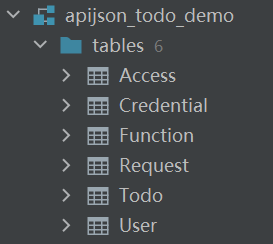
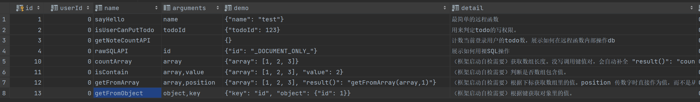
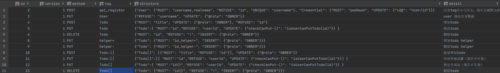
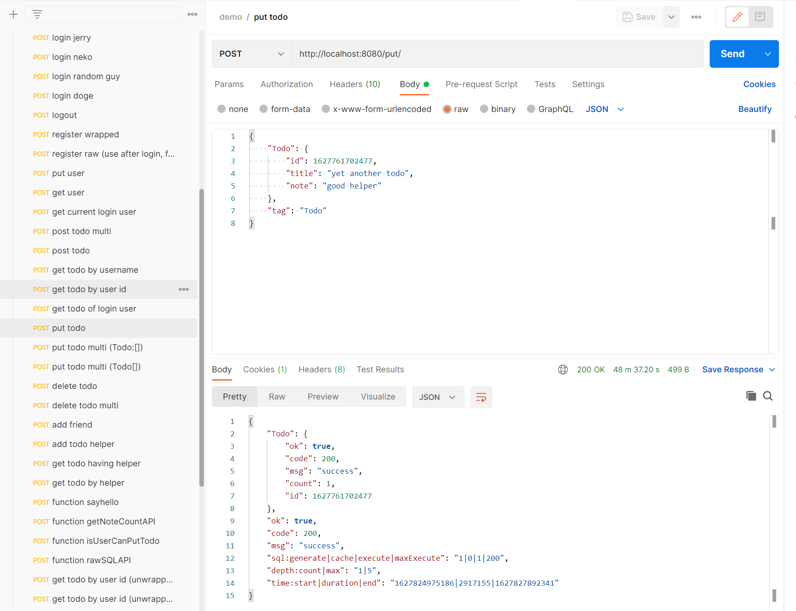
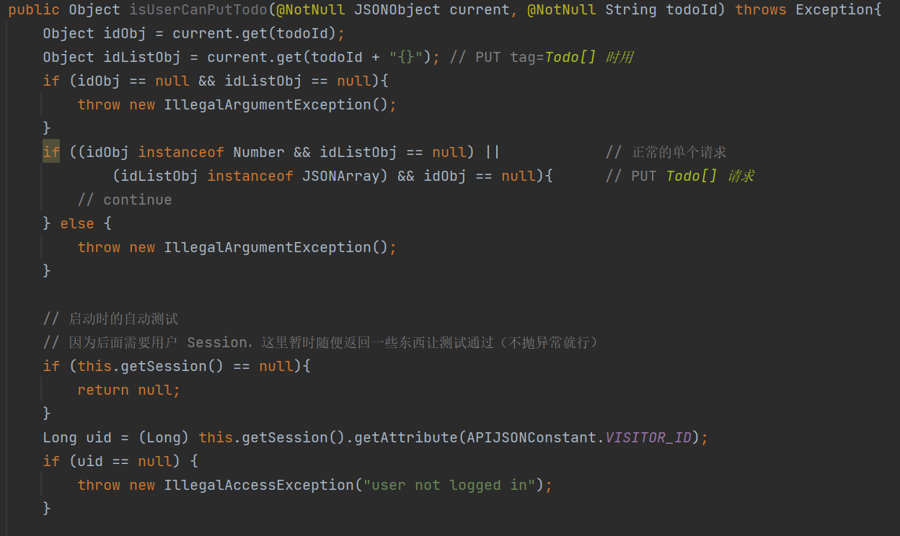

# APIJSON Todo Demo

一个尝试让 APIJSON 上手更简单一些的尝试。

本示例项目是一个基于 APIJSON 实现的 todo 系统，在官方示例项目（APIJSON-Demo）的基础上进一步简化了数据库和代码，完整实现了对一个业务表的单独/批量 CRUD 操作，并描述了如何用远程函数实现一个简单的自定义鉴权逻辑。

[阅读全文](https://github.com/jerrylususu/apijson_todo_demo/blob/master/FULLTEXT.md)

## 展示

简化、易于理解、开箱即用的数据库

完整的 CRUD 实现

自带接口调试文件（基于 Postman）

详尽的代码注释

